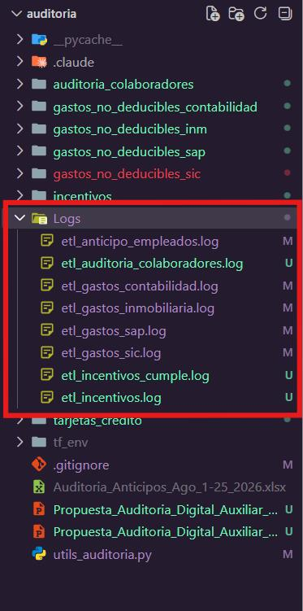
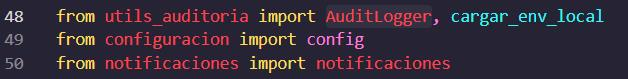
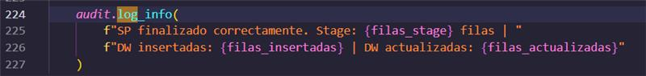

Muchachos si usaron el registro de logs en los proyectos de datos personales y anticipos?

Recuerden que eso es para cuando pasemos a producción los proyectos y estén ejecutando en el servidor, podamos ver si las ejecuciones fueron exitosas o no y el motivo del error.

En tu proyecto Deiby debes implementar esa característica.
 
Revisa los otros proyectos que hay en el repo y esta es la forma de implementarlo:

